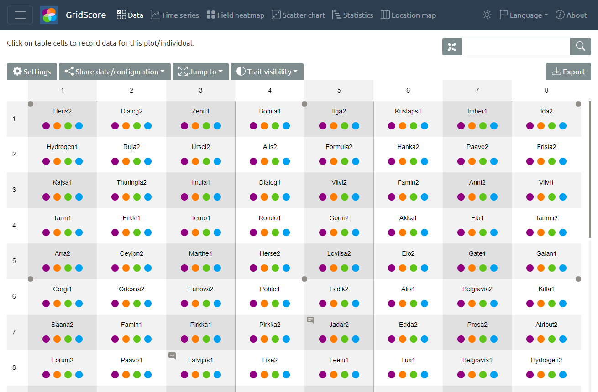
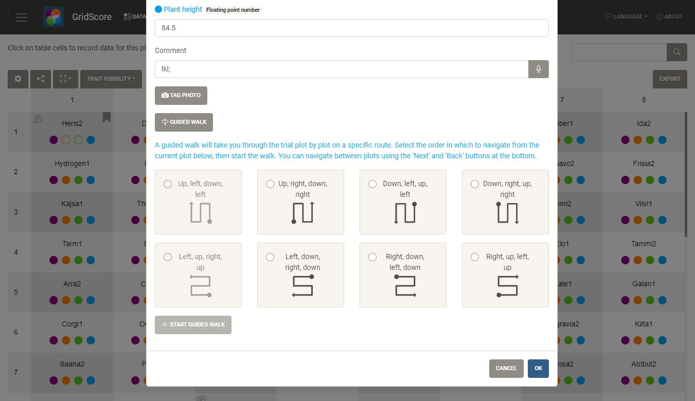

# GridScore Collecting Data

Once your trial is set up, it's time to collect some data.

## Field plan

The main data table represents your field plan with rows and columns. Each cell is a plot and shows you a short version of the germplasm/variety name. The coloured dots in each cell represent whether the respective trait has already been scored. This is especially useful when scoring time-based traits like emergence, which allows you to only visit the cells without the corresponding data indicator. Clicking on a cell opens the data entry dialog where you can enter the data values for each trait.

## Data input

Data is entered for each defined trait using the type-specific input fields. Dates are scored using a calendar, numbers using a number input and categories using a dropdown box.
Optionally, comments can be added to data entries. Text-to-speech can also be used for these comments instead of manually typing data into the app.

## Guided walk

Optionally, you can use the `guided walk` feature, to let GridScore guide you through the trial one plot at a time. There are 8 walking orders available for you to choose from and they can be started from any plot within the trial.

## Image tagging

In addition to the features highlighted above, GridScore can prompt your mobile device to take a photo which will then be tagged with the germplasm/variety name and a timestamp to significantly reduce the amount of effort that has to go into organising your photographs later.