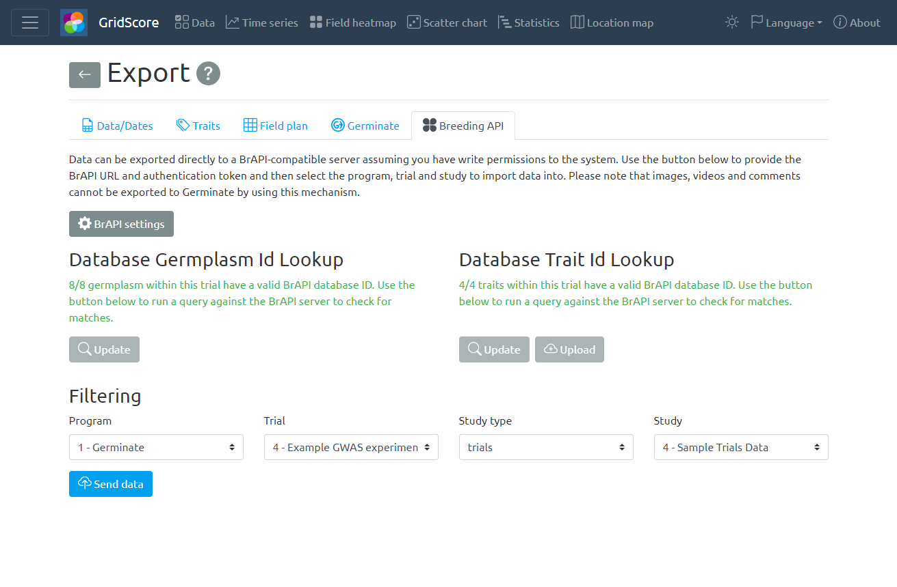

# Exporting Data

At any point in time data can be exported from GridScore into simple and reusable formats. The export screen shows multiple tabs each of which exports the data in a slightly different format.

## Data/Dates

The first tab exports the data into a data matrix with the plant/plot identifiers in the first column and the trait names as the following column headers. Finally, there are columns for latitude, longitude, elevation and comments. The data and recording dates are then shown in the matrix part of the output.

You can copy/paste this data straight from the text boxes into other tools like Excel or download the data file in a tab-delimited text format.

## Traits
The second tab exports the trait definitions including their name, type and restrictions.

## Field plan

Sometimes it may be useful to export the data in the exact same format as the field plan. For those cases, the field plan tab lets you choose a trait for which to export the data. 

You can copy/paste this data straight from the text boxes into other tools like Excel or download the data file in a tab-delimited text format.

## Germinate

[Germinate](https://ics.hutton.ac.uk/get-germinate) is a well-known plant genetic resources database which stores various types of data including phenotypic data. Germinate also has a well-defined set of [data templates](https://github.com/germinateplatform/germinate-data-templates) which are used to import data into Germinate. GridScore can export your data straight into the phenotypic data template of Germinate so you don't have to reformat your data manually.

To do so, select the Germinate tab on the export page. If you have multi-traits in your trial, you can choose if and how to aggregate them. For numeric traits, you can choose to use the last value, the average or the sum, while for text, date or categorical traits you only have the option to use the last value.

If you choose not to aggregate a trait, each value will be individually exported.

To start the export process, press the `Export to Germinate format` button. This may take a few seconds depending on the size of your trial and your internet connection.

Once exported, your data will be downloaded as a Germinate template Excel file.

## Breeding API

The

The  [Breeding API (BrAPI)](https://brapi.org) project is an effort to enable interoperability among plant breeding databases. BrAPI is a standardized RESTful web service API specification for communicating plant breeding data. This community driven standard is free to be used by anyone interested in plant breeding data management.

GridScore can export trials data through the Breeding API. To do so, select the "Breeding API" tab on the export page. Make sure to have valid BrAPI settings like the BrAPI endpoint URL and a valid authentication token. Once set up, use the lookup sections to check for matches of germplasm and traits. All germplasm **has** to exist in the database before you can continue. For traits, it's possible to create them through BrAPI once the lookup returns.

When all germplasm and traits have valid matches, you can select the program, trial and study that the data should be imported into.