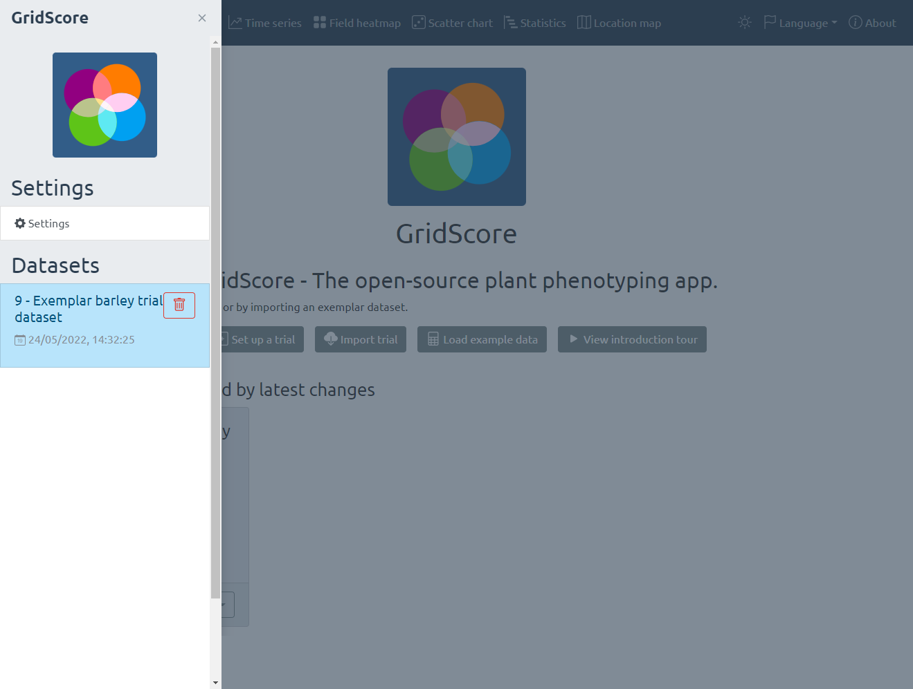

# Interface Overview

The home screen of GridScore shows the four most common options for new users: `Set up a trial`, `Import trial`, `Load example data` and `View introduction tour`. The first will take you to the <a href="trial-setup.html">trial setup screen</a> where you are able to set up a new trial from scratch. To import an existing trial, select `Import trial` which takes you to the <a href="importing.html">import screen</a> where you can load existing trials that have been shared with you or import existing data into a trial. To load an exemplar trial, select the `Load example trial` option. This loads a barley dataset that has been scored with GridScore which you can explore to see how GridScore works. The last option highlights the main features of GridScore in a step-by-step tour.

If you have used GridScore before, your trials are listed below. Your most recently used dataset is shown first so you can continue where you left off.

The main navigation menu takes you to the main sections of GridScore. Those include the data input screen and a selection of data visualizations. Additionally, this is where you can toggle the dark mode as well as switch between interface languages.

The button in the top left toggles the side menu which allows fast and easy switching between your trials. It also gives you access to the GridScore settings.

## Settings

Some more advanced settings are located on the dedicated settings screen. Colors, column widths, column/row numbering, voice feedback, navigation mode as well as many other options can be set here. The <a href="settings.html">settings page</a> covers all configuration options.