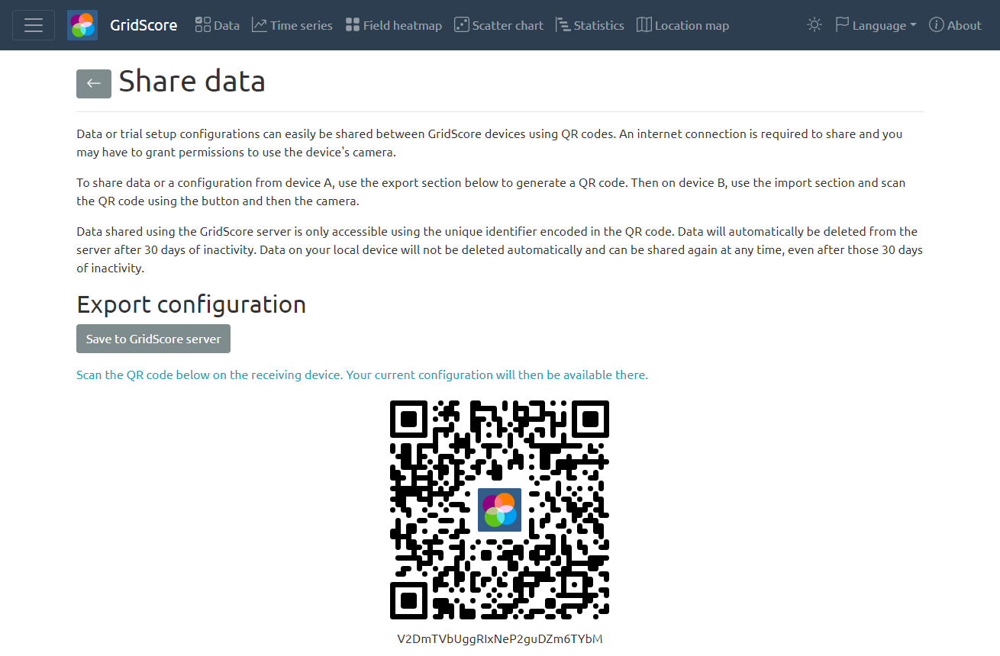
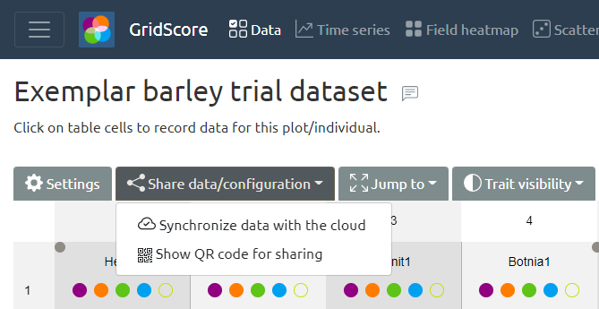

# Data Sharing

GridScore offers a mechanism with which trial setups and collected data can easily be shared between devices simply by scanning a QR code. This makes it particularly easy to set up a trial from the comfort of your office laptop/desktop computer where you may have your germplasm lists and trait definitions and then transferring the created trial to the mobile data collection device.

This is achieved by selecting the `Share data/configuration` action on the data view. If this is the first time sharing this trial, you will see a screen like the one below.

To receive the trial on the other device, select `Import trial` and use the button to start the QR code scanner. Point it at the QR code on the source device and your trial should show up in an instant.

Once a trial has been shared between devices, they are all linked together through the internal trial identifier. From this point on, any device can select the `Save data to the cloud` and `Load latest data from the cloud` actions. These will either save the data back to the GridScore server or load data from it. Please ensure that these operations are not executed simultaneously on different devices as overwriting your own data is possible. If you are collecting data on different devices, make sure not do make changes at the same time. Rather load the latest data on device A, then make changes and save it back. Then you can load the updated data on device B and make changes there.

At any time, you can use the QR code sharing mechanism again to share the trial with more devices. You can also load the updated data onto your laptop/desktop PC to make the most of the data visualizations on a larger screen.