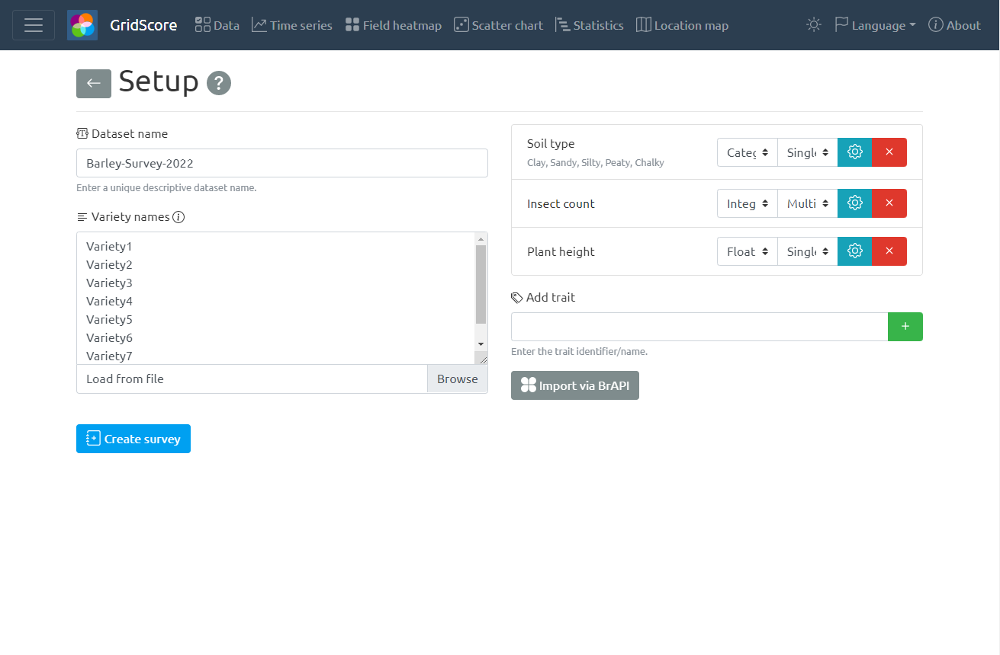

# Survey Setup

Surveys are similar to <a href="setup-trial.html">Trials</a> in many ways. However, the main goal of a survey is to score material that is not physically located in a grid-like fashion. For surveys, GridScore will basically act as a long list of material, but it still offers all the functionality that would be available in a trial.

In addition to this functionality, you can add germplasm/varieties to a survey over time. This is particularly useful if the list of material to score is open ended or just not finalized at the time of survey creation.

We will now highlight the differences on the user interface compared to the trial setup. Everything else has already been covered in that section.

- The germplasm/variety names can only be provided in the "list" mode, not "tab" mode as surveys only support lists.
- Row/column counts and field plan layouts are not available.