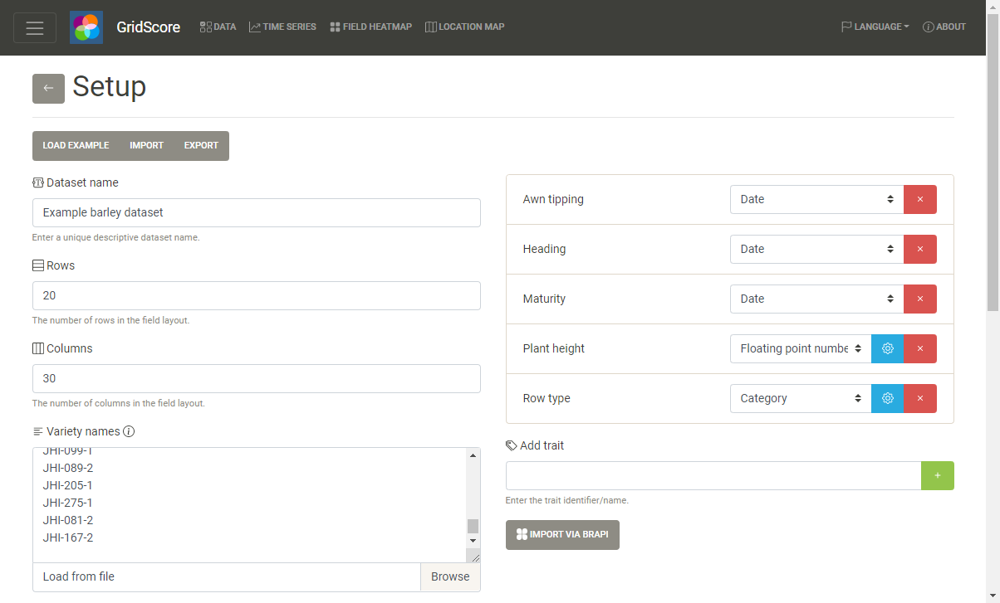
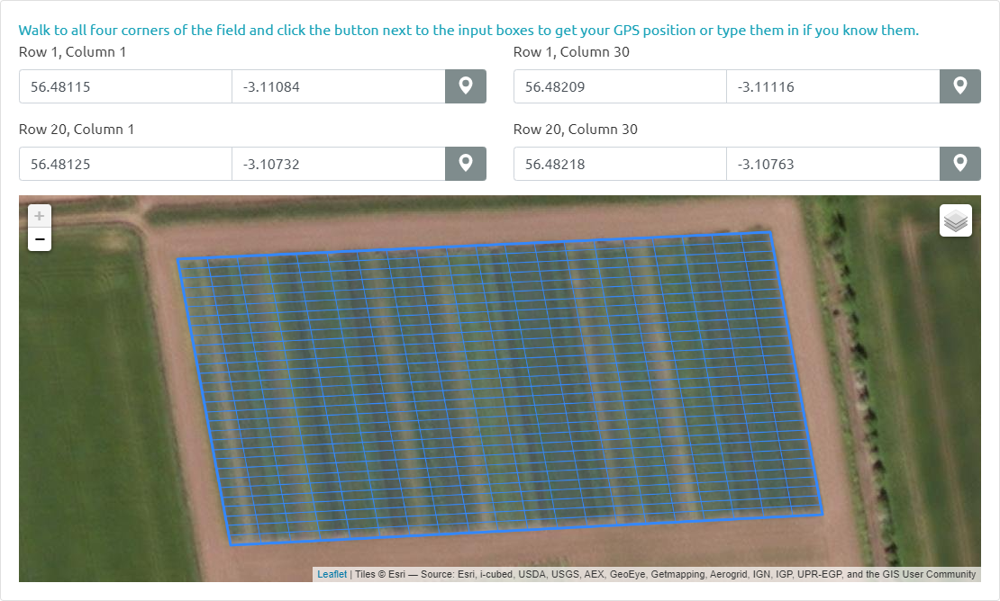
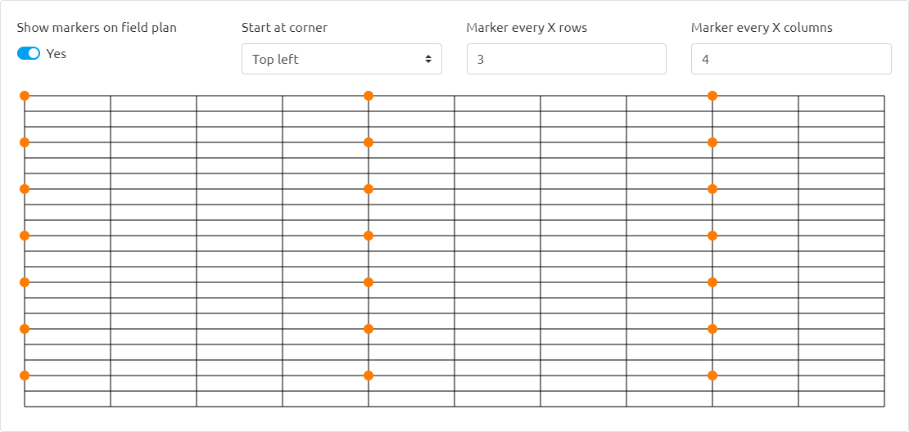

# Trial Setup

GridScore allows you to define as many trials as you want and keep all the data on your device or share it with others.

To set up a new trial hit the `Set up a trial` button on the home screen of GridScore, or, in the side menu, click `Add` in the `Datasets` section.



The setup screen is used to define some basic characteristics of your field trial. An ideally unique, but definitely memorable name should be chosen for each trial. The name should make it easy to identify the trial you're looking for. So something like `Drought trial Field A 2021` would be ideal.

Row and column counts as well as a list of germplasm/variety names/identifiers is used to identify each plot uniquely. The identifiers can be provided either in a list - one identifier per row - so that the grid is filled in "reading order" from top left to bottom right, or, simply paste the field plan in tabular form from Excel. Make sure the number of rows and columns match what you specified previously.

As an example, here are the setups for both row and tab mode that will result in the same field layout:

```
A
B
C

E
F
```

```
A B C
  E F
```

Note how empty/blank cells in your trial can be achieved by leaving the row/cell blank.

Traits are then defined along with their type which can be one of `integer`, `floating point`, `date`, `text` or `categorical` (pick from a list of options). For numeric traits, minimum and maximum values can be defined to make sure that any data that is recorded falls within these limits. For categorical traits, the actual categories need to be defined. Use the cog wheel button to enter these.

Additionally, traits can either be single- or multi-score traits meaning that they are recorded only once per plot or multiple times (at different time points) per plot.



Optionally, the corner points of the field can be configured. This can either be done my walking to the corners of the field and clicking the button to get your GPS position or by manually entering the location. Defining the corner points allows GridScore to show your recorded data in the context of the field plots as well as to highlight your location in the data recording table for easier navigation and orientation.



Additionally, if you are using posts/markers in the field to help with orientation, you can define these in GridScore so that they show up on the main data view. Use the `Add visual markers to field plan` button to define the markers. Here you can enable this feature, then select the corner to start counting from and finally select how often a marker/post appears in row/column direction. A visual preview shows you what this will look like so you can verify your input.