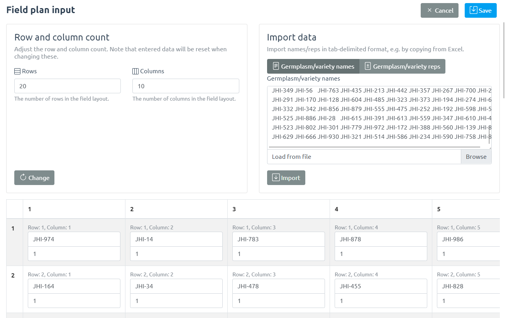

# Trial Setup

GridScore allows you to define as many trials as you want and keep all the data on your device or share it with others.

To set up a new trial hit the `Set up a trial` button on the home screen of GridScore, or, in the side menu, click `Add` in the `Datasets` section.

The setup screen is used to define some basic characteristics of your field trial. An ideally unique, but definitely memorable name should be chosen for each trial. The name should make it easy to identify the trial you're looking for. So something like `Drought trial Field A 2021` would be ideal.

Row and column counts as well as a list of germplasm/variety names/identifiers is used to identify each plot uniquely.

The germplasm as well as the rep identifiers can be specified by clicking on the "Define" button in the "Germplasm/varieties" section.

The identifiers can be provided by either entering them into the table at the bottom of the screen or by copying and pasting from a spreadsheet like Excel into the top right as seen in the screenshot. Make sure the number of rows and columns match what you specified previously.

Note that empty/blank cells in your trial can be achieved by leaving the cell blank.

Traits are then defined along with their type which can be one of `integer`, `floating point`, `date`, `text` or `categorical` (pick from a list of options). For numeric traits, minimum and maximum values can be defined to make sure that any data that is recorded falls within these limits. For categorical traits, the actual categories need to be defined. Use the cog wheel button to enter these.

Additionally, traits can either be single- or multi-score traits meaning that they are recorded only once per plot or multiple times (at different time points) per plot.

Optionally, the corner points of the field can be configured. This can either be done my walking to the corners of the field and clicking the button to get your GPS position or by manually entering the location. Defining the corner points allows GridScore to show your recorded data in the context of the field plots as well as to highlight your location in the data recording table for easier navigation and orientation.

Additionally, if you are using posts/markers in the field to help with orientation, you can define these in GridScore so that they show up on the main data view. Use the `Add visual markers to field plan` button to define the markers. Here you can enable this feature, then select the corner to start counting from and finally select how often a marker/post appears in row/column direction. A visual preview shows you what this will look like so you can verify your input.

## Trait definitions

This section will highlight trait definitions in more detail and give examples of common definition patterns.

Trait definitions consist of up to four parts.

1. Distinctive name
2. Data type
3. Measurement type
4. Restrictions

Each of these will be covered in depth below.

### Trait name

The name of a trait should be chosen such that it is both concise and descriptive. It should be concise so as not to take up too much screen space within GridScore, but should provide enough information to be meaningful. Common traits that everyone will be familiar with could be abbreviated, while more specialized traits may require a longer name.

### Data type

As mentioned before, valid trait types are `integer`, `floating point`, `date`, `text` and `categorical`.

Traits of type `integer` are whole numbers (e.g. `1`, `2`, `3`, etc.) often used for rating scales, counts or encoded categories.

The type 'floating point' represents decimal point numbers (e.g. `1.23`, `43.442`, etc.). They are mostly used for measured values like height, weight, NDVI and similar traits.

`date` based traits represent a single point in time or more specifically, a single day. These types of traits are most often used to indicate specific events like emergence date or flowering date. A measurement of this trait would signify that the event represented by the trait took place at the measured date.

Often, traits have predefined values and during scoring one of these would be chosen for a plant/plot. This can be achieved by using `categorical` trait definitions. Examples could be growth type (`erect` vs `prostrate`) or flower color (assuming only a few options exist). Another example would be traits that represent a boolean variable, e.g. `yes` and `no`. Another example could be `low`, `medium` and `high`.

Finally, `text` traits allow any kind of input and should only be used if none of the other types are appropriate. Remember, that there is also a comments box for each plant/plot for free text comments.

### Measurement type

The measurement type of a trait determines how often it can be scored per plant/plot. The default setting is `single`, which means that a trait is only scored once per plant/plot. Assuming there is a height trait, if  using the `single` measurement type, only a single height measurement can be recorded for each plant/plot.

If a trait needs to be scored multiple times, for example to keep track of the development over time, then `multi` measurements are the way to go. These allow the user to record as many measurements per plant/plot for this trait as required. Each measurement is tagged with the timestamp of when it has been created.

Sometimes, it may be tempting to just define all traits as `multi` traits, however, traits like flower color or growth type do not change over time and can therefore safely be defined as `single` traits. In addition to being more straightforward, `single` traits also make the visualizations easier to use as you don't have to select how multiple measurement should be aggregated.

One should therefore put some thought into which measurement type to use.

### Restrictions

To limit a trait to a range of predefined values, restrictions can be put in place for certain types. For traits of type `integer` or `floating point`, minimum and maximum values can be defined to prevent measurements outside of this range to be recorded. 

`categorical` traits require the definition of the valid trait categories. If, for example, defining the categorical flower color trait, all valid flower colors have to be defined so that the people scoring the trial can easily pick from these options.