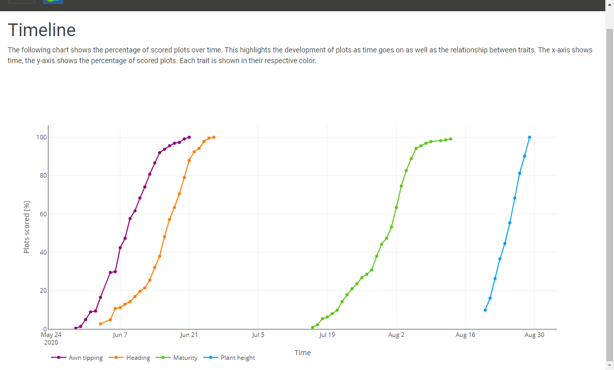
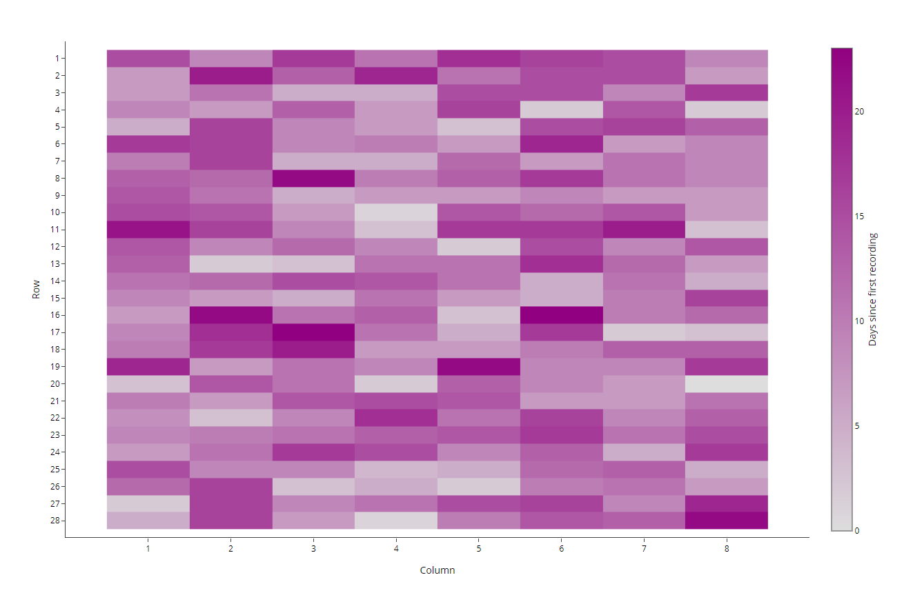
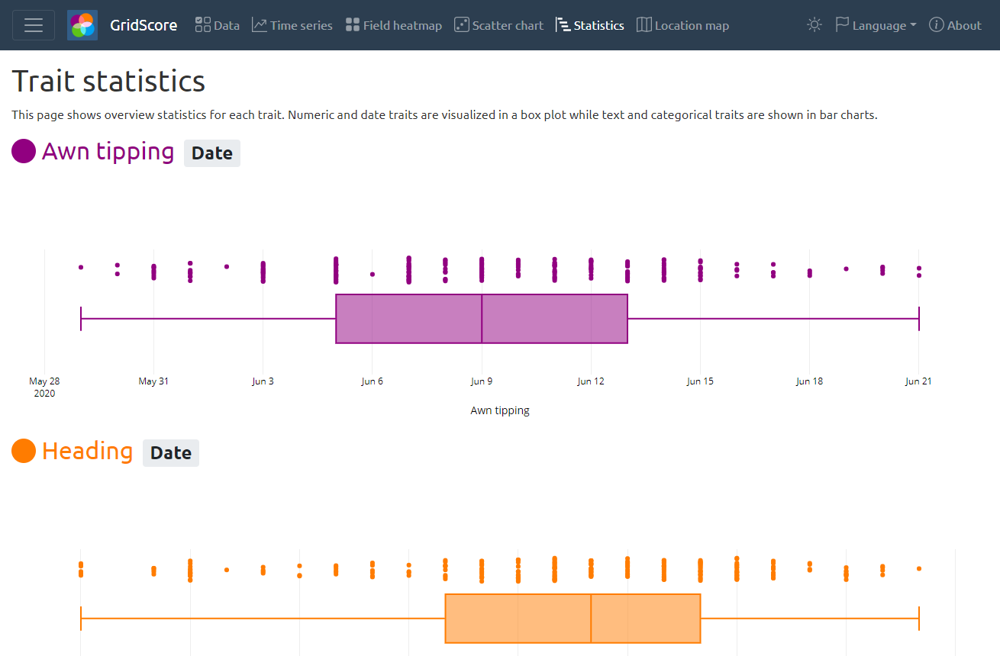

# GridScore Visualizing Data

GridScore can visualize your trials data as you collect it right there on your phone or tablet. You can also look at these visualizations or export them for use in presentations or publications when you're back at your desk.

## Timeline

The timeline chart shows time on the x-axis and the percentage of scored plots on the y-axis. This gives you an indication on how many plots have already been scored per trait. This represents the development over time, and can highlight differences in traits or time offsets between traits.

## Heatmap

Sometimes there are factors that can affect certain parts of the field. The heatmap plot shows your data in a colour-coded way to highlight possible localised artifacts. For date and text traits, the heatmap shows the recording date in days after the first data value. For integer and floating point traits, the heatmap shows the actual data value.

## Trait statistics

Another way of looking at your data is by plotting the data for each trait in either a boxplot or a bar chart to show the value distribution. This highlights important statistics like minimum, maximum, median as well as outliers.

## Scatter plot

Scatter plots are a nice way of highlighting correlations, clusters or outliers in your data. Select two traits to see a scatter plot between them. Hover over a data point to identify the germplasm/variety responsible for the data point.